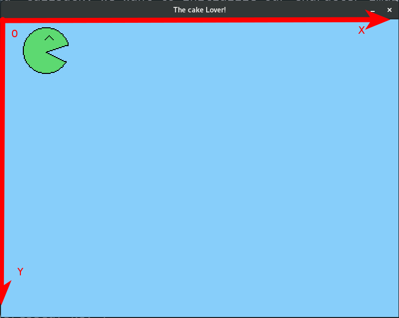

### Basics of the game
In this part, we're going to set up,
#### Understanding Love2D game loop
If you're coming from scratch, you know that Scratch is "Event driven" which means every action is a reaction to an event : started, touched, etc.
In Love2D, the game engine is a big loop, with different steps having different roles :
 * load : initialize your game with your objects (characters, cakes, ...)
 * update : update values for each object (position of your character, status (game over?), points ...)
 * draw : render the objects (characters, cakes, points, ...)
 * keypressed, keyreleased : when the user is using its controls
 * ... (the full list is [available here](https://love2d.org/wiki/love#Callbacks) )

Each step (called "callbacks") is executed one after another in a fast manner in order to handle movement, update of your game, and its rendering.
Hence the skeleton of our game will be the following :
```

```

Name the file main.lua and run it with the command ``` love . ```.
You should have a black window.
Let's quickly name it. Let's add a new loop callback called "load" which will execute when we start the application.
```
function love.load()
end
```

Inside this callback, we're going to use the [window object](https://love2d.org/wiki/love.window) provided by Löve2D to set the title.
```
title = "The cake Lover!"
love.window.setTitle(title)
```

You can probably recognize that title is a variable that we use on the [setTitle function](https://love2d.org/wiki/love.window.setTitle).
You should obtain the following code :
```

```

By running it, you should see that the title of our window has changed. Time to start the game !

#### Environment
Before having a character, we want a world to put our character in !
We're going to set a background when we start.
This time, we're going to use the ["graphics" object](https://love2d.org/wiki/love.graphics) from Löve2D to call the ["setBackgroundColor" function](https://love2d.org/wiki/love.graphics.setBackgroundColor).
It's also a part of our initialisation step, so we're going to add it to the "load" callback.
```
love.graphics.setBackgroundColor(135, 206, 250) ```

The 3 parameters are the **R**ed, **G**reen and **B**lue value of your color, also named RGB. Of course, feel free to change it whatever color you prefer :)

To simplify the code later on, we're going to force the size of the window in the our initialisation step. To do so, we use the function [setMode function](https://love2d.org/wiki/love.window.SetMode) from the "window" API in the "load" callback.
```
window.height = 600
window.width = 800
love.window.setMode(window.width, window.height)
```

and create the "window" variable outside at the beginning of your file
```
window = {} ```

You should get the following code
```

```

#### Character
##### Generic form
As a first step, we want to create a circle that'll be our character.
We're going to use the graphics API again (like for the background) to [create our circle](https://love2d.org/wiki/love.graphics.circle);
As a parameter, it takes the original position in our window as well as its radius. Add the following code inside the "draw" callback.
```
  love.graphics.setColor(255, 255, 255)
  love.graphics.circle("fill", 300, 300, 50)
```
You should end up with the following code :
```
  
```

##### As a sprite
That's where the fun begins !
You'll want to remove the code that we did before as a circle then start by creating a variable, global so we can access it in different part of the loop callback. It'll create an object that will contain, later on, all the information of our player.
Before the load callback, input the following piece of code.
``` player = {} ```

Then, in the "load" callback, we want to initialize our character image.
Feel free to use Piskel to create a new image at your taste !

``` player.image = love.graphics.newImage('assets/character.png') ```

And finally, in the "draw" callback, add the following code to get the image displayed.

``` love.graphics.draw(player.image, 100, 100) ```

You should get the following code :

``` ```

#### Mouvement
Now, we want our character to move around !
To do that, we're going to map the directional arrows from your keyboard to move our player around our game.
First of all, create 2 variables for the user's position. A position of a player is based on a grid with 2 values : X (the horizontal position) and Y (the vertical position).
Let's also add a speed to it, which we'll use just after to smooth up the mouvement.
```
player.x = 0
player.y = 0
player.speed = 150
```
Then let's adapt our older code with these new values. Change the "draw" function of the "draw" callback to use ```player.x, player.y``` instead of ``` 100, 100 ```
If you run the code now, with the value of "0" for x and y, our character is in the left corner.
The higher is X, the more you'll be on the right side. The higher is Y, the further our character will be to the top !

By changing player.x from your "load" callback, it'll change the position every time you reload the game.
Let's make this dynamic !
In your "update" callback, you'll have to check which key is pressed to change the position accordingly.

To do that, we're going to use the ["keyboard" API](https://love2d.org/wiki/love.keyboard), and particularly using a condition to check if the arrow key ["isDown"](https://love2d.org/wiki/love.keyboard.isDown). The 4 arrows keys are called "up", "down", "left" and "right".
Inside this condition, we'll have to change the position of our character.
 ```
 if love.keyboard.isDown("right") then
  player.x = player.x + (player.speed * dt)
 end
```
Now, make the 3 others keys, "down", "up" and "left"!
Finally, you should end up with the following code :
```

```
##### What's dt ?
dt is a mathematical representation of the time spent. This allow us to not rely on fixed values which will depend on your processor speed and hence will act the same way on any device.
#### What's the speed for ?
Try removing it and you'll see :)
##### Why we're not using the keypressed callback
The reason is quite simple. Try it yourself :
```
function love.keypressed( key )
  if key == "left" then
    player.x = player.x - 1;
  end
  if key == "right" then
    player.x = player.x + 1;
  end
  if key == "up" then
    player.y = player.y - 1;
  end
  if key == "down" then
    player.y = player.y + 1;
  end
end
```
keypressed works fine for independant key stroke, like you would use for "jumping" on a platform, or "fire" to stop a character from firing and moving. When the key is held (ie, not released) and repeated, it's also blocking other events from this callback. Hence, if you try to move in diagonal using keypressed for all movements "actions", it's impossible.

Update allows that, it's simply a case of scenario.
