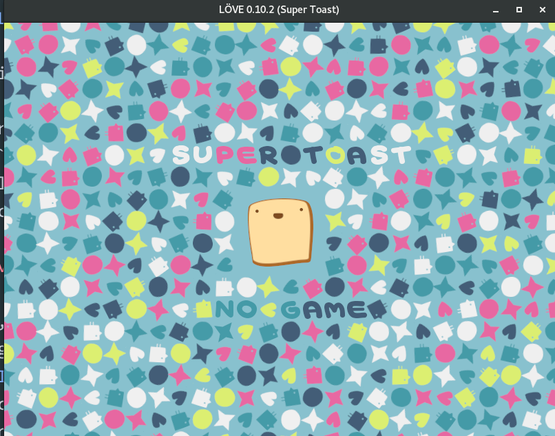

## A basic game
In this sushi-card, we're going to create a simple game.
The game goal is to get as many points as possible. When eating cakes, you get points, but also get bigger. When drinking water, you get smaller. When eating poison, you lose.
### Introduction to Love2D
[Love2D](https://love2d.org/) is a multiplatform, open-source engine to create games. It'll also introduce how to make simple graphics to use in game.
#### Checklist based on the "game-design" sushi-card
 * A character : the cake-lover !
 * A theme : Food !!
 * Obstacle : the poison X_X
 * Controls : by keyboard
 * Surprises : that's a challenge for you ;)

### Requirements
Install Love2D which is our game engine.
#### Installing Love2D
##### Windows
Love2D provides installers from their website.
##### Linux
Depending on your distribution, it may be packaged using ```apt-get install love2d```
If it's not available as a package, you'll have to build it. Precise instructions are described on [their wiki](https://love2d.org/wiki/Building_L%C3%96VE).
After installing by running love2D  in your console with ``` love  ```, you should see the 
#### (Optional) Installing Piskel
If you which to create your own character, it's recommended to install Piskel. You can get the installer [on their website](http://www.piskelapp.com/download).
All images provided for this sushi card are accessible as .piskel format so you can modify them.
This is not required, if you have access to internet you can also use the [online version](http://www.piskelapp.com/).
